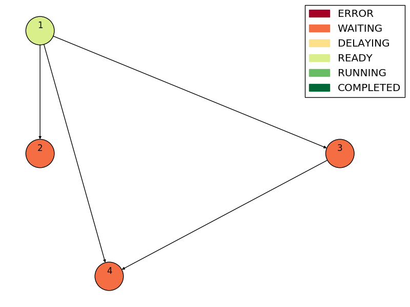
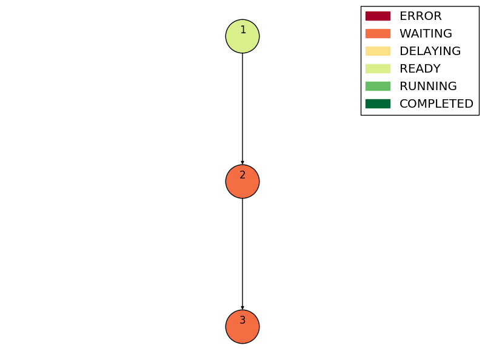
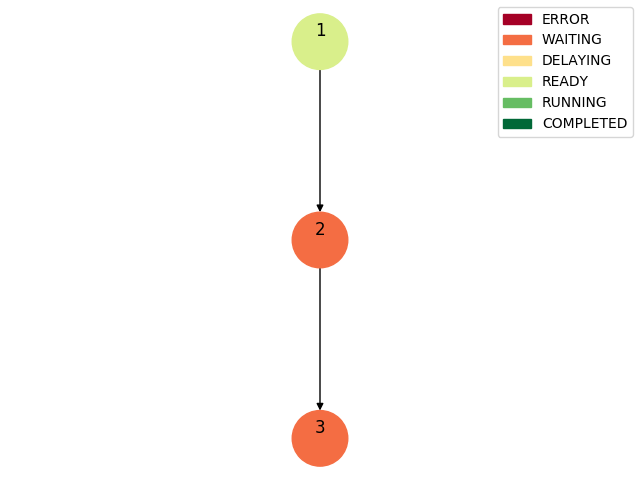
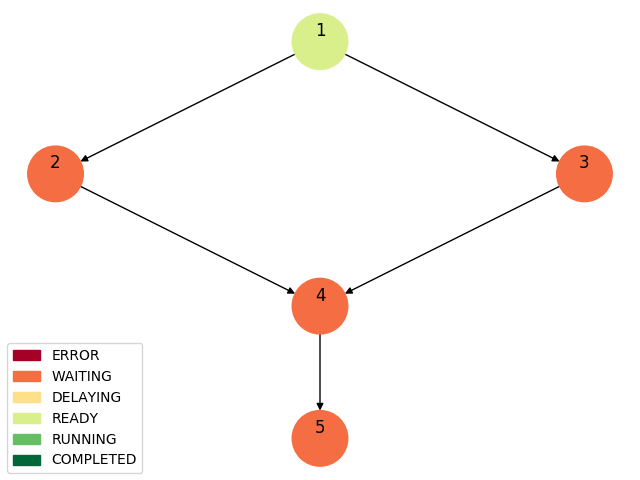
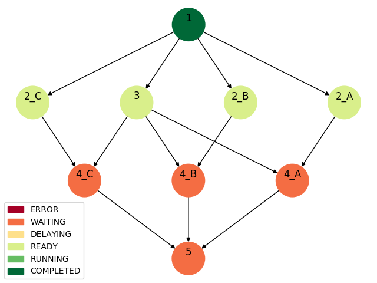
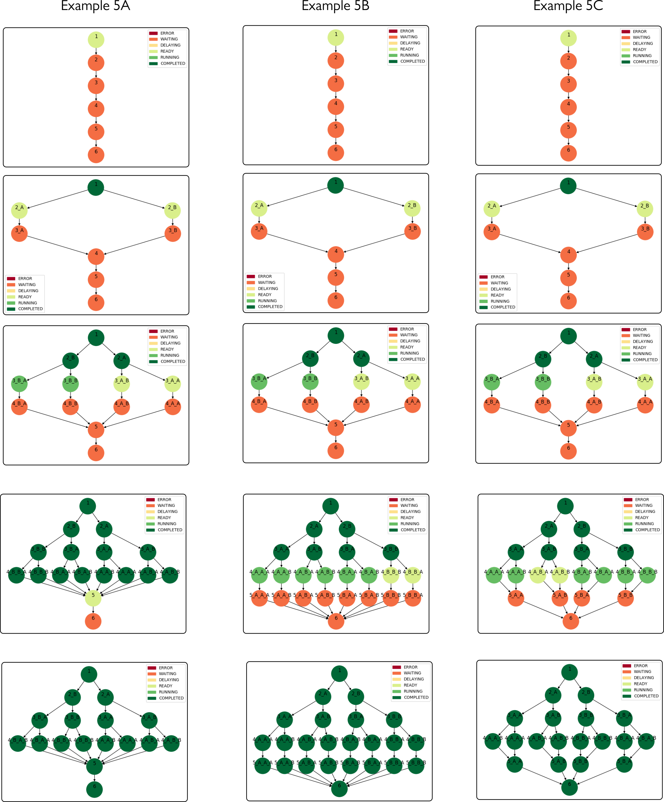

# Introduction

Welcome to the SWEEP Docs! You can use our SDK to access SWEEP endpoints or code against our REST endpoints.

We have language bindings in Python, and are working on JavaScript! You can view code examples in the dark area to the right, and you can switch the programming language (only Python where applicable) of the examples with the tabs in the top right.

## !!! changes to the workflow definition !!!

Some changes have been made to the structure of the workflow definition. If you have old workflows from prior to this you will have to make the followingchanges, and re-upload the workflow definitions:

The following **task property names** need to be changed:
1. "follow_multiplicity" --> "follow"
2. "partitioned_input" ---> "scatter"

And the property "dynamic_multiplicity" is no longer used. The number that a task is expanded to is decied by the length of the list specified to "scatter"*[]:

The values of the properties do not need to be changed.


# Defining workflows

A workflow is a collection of tasks, represented as a directed acyclic graph (DAG), where an edge from task A to task B indicates
that task B can start after task A is finished. The structure and syntax of workflow definitions are defined below.

## Definition of **workflow**

> workflow definition


```python
{
    'workflow_id' : str,
    'config' : dict,
    'tasks' : dict list
}
```


* **workflow_id**: unique identifier of the workflow

* **config**: optional **workflow configuration** dict, contains directives for workflow orchestration

* **tasks**: list of **task definition** dicts, each representing a task


## Definition of workflow configuration

> workflow configuration

```python
{
    "max_task_concurrency" : int,
    "max_task_runtime" : int
}
```

* **max_task_concurrency**: max number of tasks to run concurrently

* **max_task_runtime**: task timeout in seconds


## Defintion of tasks

> task definition

```python
{
    "id" : str,
    "function_name" : str,
    "image_name" : str,
    "image_tag" : str
    "successors" : str list,
    "properties" : dict
}
```

* **id**:  unique identifier

* **function_name**: for function-based tasks: the name of the function that the task runs. the function must be registered in SWEEP.

* **image_name**, **image_tag**: for container-based tasks: the name and tag of the container the task runs. a container definition for this name and tag must be registered in SWEEP.

> a task should have either **"function_name"** or **image_name** and **image_tag** spceified

* **successors**: a list of tasks that should be invoked when the task finishes. this defines the DAG representing the workflow.

* **properties**: optional **task properties** dict

## Defintion of **task properties**

> task properties

```python
{
    "position" : str,
    "delay" : int,
    "static_input" : object,
    "multiplicity" : int
    "deploy_conditions" : expr list,
    "scatter" : expr,
    "follow" : str,
    "environment" : dict list | expr,
    "command" : str list,
    "static_output" : expr
}
```


> ### Task properties
> Task properties are static values that are associated with a task. This means that they do not change over time,
> they are associated with a workflow (unlike task attributes described below, which are associated with a particular launch of the workflow).


* **position**: the position in the task graph. used to define the starting task.
> There must be exactly one task with the property **"position" : "start"**. This will be the first task that is executed, and all other tasks should be on a path from the start task in the DAG representation.

* **delay**: time in seconds that a task should wait before being launched. the delay begins when the task is otherwise ready to lauch, after all its predecessors have finished.
* **static_input**: input to the task that is independent of the launch, other tasks, etc.
* **multiplicity**: specifies a number of times a task should be replicated.
* **deploy_conditions**: list of conditions in the form of expressions depending on the output of this task predecessors that must be fulfilled in order for the task to be launched. if all predecessors have finished but any of the conditions is not true, the task fails.

>Example of **deploy_conditions** property with one condition:

```python
"deploy_conditions" : ["predecessor_outputs['1']['buckets'][0]['count'] >= 4"]
```


* **scatter**: an expression that indicates which part of a predecessors output should be scattered over: this output is assumed to be of list-type, this task will be replicated for each element of this list, each new task replica receiving one element as input.
* **follow**: specifies a predecessor ID (P) whose replication factor this task (T) is to follow. A replica Ti of this task will gather all aggregatedd output of the corresponding replica Pi of the predecessor. See example below how scatter and follow can be used to define multi-level scatter and gather behaviour.
* **environment**: only valid for container-based tasks. specifies environment variables the image, overriding the one specified when building the image and the one in the container definition. one dictionary per environment variable, the dictionary must contains 2 items: "name" and
"value"

>Example of **environment** property:

```python
"environment" : [
                {"name": "EVAR1", "value": "1"},
                {"name": "EVAR2", "value": "hello"}
              ]
```

* **command**: only valid for container-based tasks. specifies a command to run in the image, overriding the one specified when building the image and the one in the container definition.
* **static_output**: specfies a pre-determined item in the task's output. it will appear in the output-dictionary of a task with the key "static_output", along with any other output that the actual task generates. **NOTE:** *unlike static_input, the *value* must not be determined before launch: static_output may be a str, in which case it is considered a dynamic property (see below), meaning it can e.g. specify a value in terms of the predecessor outputs.*

>Example of **static_output** property:

```python
"static_output" : "predecessor_outputs["1']['env_vars']"
```


> ### Dynamic task properties
> Dynamic task properties are properties whose value is decided at runtime. They are specified by strings expressing Python expressions that evaluate to some value.
> Their conditions are expressed in terms of "predecessor_outputs[id]" (the dict containing outputs of all predecessors is stored in a variable names predecessor_outputs).

### The properties that must be dynamic are:
* **deploy_conditions**
* **scatter**

### The properties that may be dynamic are:
If their value is of type str: they are treated as dynamic, to be evaluated
Else (e.g. if the type is an int) : that specifies the value

* **environment**
* **static_output**
* **static_output**


## Examples

###  Example 1: simple workflow definition

See [examples/example1/example1.json](examples/example1/example1.json)

```python

{
  "workflow_id": "example1",
  "config": {},
  "tasks": [
    {
      "id": 1,
      "function_name": "my_lambda_function",
      "successors": [
        2,
        3,
        4
      ],
      "properties": {
        "position": "start"
      }
    },
    {
      "id": 2,
      "function_name": "my_lambda_function",
      "successors": [],
      "properties": {
        "static_input": {
          "msg": "static input message"
        }
      }
    },
    {
      "id": 3,
      "function_name": "my_lambda_function",
      "successors": [
        4
      ],
      "properties": {
        "delay": 10
      }
    },
    {
      "id": 4,
      "function_name": "my_lambda_function",
      "successors": []
    }
  ]
}

```

### Example 1: DAG representation

<div style="text-align:left"></div>


###  Example 2: a workflow with a scattered task

See [examples/example2/example2.json](examples/example2/example2.json)


```python

{
  "workflow_id": "example2",
  "config": {},
  "tasks": [
    {
      "id": 1,
      "function_name": "firstFunc",
      "successors": [
        2
      ],
      "properties": {
        "position": "start"
      }
    },
    {
      "id": 2,
      "function_name": "multFunc",
      "successors": [
        3
      ],
      "properties": {
        "scatter": "predecessor_outputs['1']['tile']"
      }
    },
    {
      "id": 3,
      "function_name": "otherFunc",
      "successors": []
    }
  ]
}


```


If the function **firstFunc** generates the following output:

```python
{ "buckets": [{"count": 3}],
  "tile" : [{"tile_id" : 1}, {"tile_id" : 2},{"tile_id" : 3}]}
```


Then task **2** will be expanded to tasks **2_A**, **2_B**, **2_C**, each receiving the following input (where X = 0,1,2):

```python
{ "buckets": [{"count": 3}],
  "tile" : {"tile_id" : X}}
```


### Example 2: DAG representation
Task **2** has dynamic multiplicity.

<div style="text-align:left"></div>

Upon completion of task **1**, task **2** is expanded into 3 tasks: **2_A**, **2_B** and **2_C**

<div style="text-align:left"></div>


###  Example 3: a workflow with scatter and follow

See [examples/example3/example3.json](examples/example3/example3.json)


```python

{
  "workflow_id": "example3",
  "config": {},
  "tasks": [
    {
      "id": 1,
      "function_name": "firstFunc",
      "successors": [
        2
      ],
      "properties": {
        "position": "start"
      }
    },
    {
      "id": 2,
      "function_name": "multFunc",
      "successors": [
        3
      ],
      "properties": {
        "scatter": "predecessor_outputs['1']['tile']"
      }
    },
    {
      "id": 3,
      "function_name": "otherFunc",
      "successors": [],
      "properties": {
        "follow": "2"
      }
    }
  ]
}

```


If the function **firstFunc** generates the same output as the examle above, and task **2** is expanded in the same manner:

Then task **3** will be expanded to tasks **3_A**, **3_B**, **3_C**, each of which becomes a successor of one of the tasks expanded from task **2**:


### Example 3: DAG representation

The task with id **2** has dynamic multiplicity.

<div style="text-align:left"></div>

Upon expansion of task **2**, task **3** is expanded into 3 tasks: **3_A, 3_B** and **3_C**.

<div style="text-align:left"></div>


###  Example 4: a more complicated workflow with follow

see  [examples/example4/example4.json](examples/example4/example4.json)

```python
{
  "workflow_id": "example4",
  "config": {},
  "tasks": [
    {
      "id": "1",
      "function_name": "lambda_func2",
      "successors": [
        2,
        3
      ],
      "properties": {
        "position": "start"
      }
    },
    {
      "id": "2",
      "function_name": "lambda_func2",
      "successors": [
        4
      ],
      "properties": {
        "scatter": "predecessor_outputs['1']['tile']"
      }
    },
    {
      "id": "3",
      "function_name": "lambda_func2",
      "successors": [
        4
      ]
    },
    {
      "id": "4",
      "function_name": "multFunc",
      "successors": [
        5
      ],
      "properties": {
        "follow": 2
      }
    },
    {
      "id": "5",
      "function_name": "lambda_func2",
      "successors": []
    }
  ]
}

```


If the function **firstFunc** generates the same output as the examle above, and task **2** is expanded in the same manner:

Then task **3** will be expanded to tasks **3_A**, **3_B**, **3_C**, each of which becomes a successor of one of the tasks expanded from task **2**:


### Example 4: DAG representation

<div style="text-align:left"></div>

When task **1** completes, task **2** can be expanded. In addition, task **3** can also immediately be expanded (without waiting for all task **2** instances to complete) since its multiplicity depends on the multiplicity of task **2**, which has already been decided.

<div style="text-align:left"></div>


###  Example 5: scatter and gather

The properties **scatter** and **follow** can be used to define custom multi-layer scatter and gather structure in workflows:

<div style="text-align:left"></div>


See  [examples/example5](examples/example5) for the workflow definitions.


# Task arguments and outputs

## Outputs

Task outputs are dicts.

There are no requirements on the structure of the outputs.

If the task does not output anything, this must be represented by an empty dict.


## Inputs

Every task gets an input of the same structure:

```python
{
    predecessor_outputs : dict,
    static_input : dict
}
```

* **predecessor_outputs** contains outputs from every predecessor of the task. For every predecessor id x, it has an entry
      x : {output of task x}.

* **static_input** is the dict specified as this task's **static_input**-property in the workflow definition. Empty dict if no such property was specified.

See examples/lambda_function_template.py


>### Example task input of a task with two predecessors:

```python
{
    predecessor_outputs : {1 : {msg: "I completed successfully"} , 2 : {buckets : 10}},
    static_input : {}
}
```

 Workflows with container-based tasks
------------------------------------

### Creating a container definition and pushing it to SWEEP

SWEEP tasks can also be made up of docker images, where one task runs one container.

Instead of uploading a *lambda funciton* to SWEEP, a *container definition* is uploaded.

> A container defintion defines two things for the task
> 1. A docker image that the container will be based on
> 2. Information for defining the container (memory, cpu, command to run)

The container definition is made up by a json file

> for e.g. my_container_def.json

```python
  {
  "image_name": "my_image_name",
  "image_tag": "latest",
  "cpu_units" : "256",
  "memory" : "512",
  "command": ["sh", "-c", "echo hello"]
  }
```


* required: **"image_name"** and **"image_tag"** define the image to base the container on (this must exist in the local docker repo for now)


* optional: **"cpu_units"** and **"memory"** define the runtime resources of the container. We pay for all specified resources even if they are not used. If not specified, the minimum values are used (which are the ones in this example). See https://docs.aws.amazon.com/AmazonECS/latest/userguide/fargate-task-defs.html (Task CPU and Memory) for valid configurations for these values.


* optional: **"command"** defines the command to run when starting the container, overriding the command specified in the docker image definition. Eventually we want this to be specified in the workflow def, NOT in the container_def, but for now this is how it is implemented.


The created container can then be pushed to SWEEP:

#### Upload a container definition to SWEEP

    container_def_file = "./folder/my_container_def.json"
    response = sweep_client.upload_container_def(cfile=container_def_file)
    print(response)

    > "{'status' : 'OK', 'msg' : '"Started uploading image.'}"

**NOTE:** the specified image and tag must exist in the local docker registry.

>   **trying to push another container definition with the same image_name and image_tag will**
>
>    * update the cpu, memory and command settings
>    * NOT overwrite the uploaded image (even if it has changed in the local docker repo) UNLESS the optional argument --overwrite is given to sweep upload_container_def
>    *The idea behind this is that uploading images to AWS is slow, and it should be possible to update e.g. memory or cpu_units without uploading a new image.*


The uploading may take some time. Currently, the only way to confirm that it was uploaded is to:

#### List the uploaded container defintions


```
response = sweep_client.list_container_defs()
print(response)

> "{'status' : 'OK', 'msg' : 'Succeeded in fetching container defintions.',
    'container_defs' :
 [
	  {
             "image_name": 'my_image_name',
             "image_tag": 'latest',
             "command": ['sh', '-c', 'echo hello'],
             'cpu_units': '256',
             'imagePushedAt': '2019-07-08 16:11:11+02:00',
             'imageSizeInBytes': 2487,
             'memory': '512'}
  ]
 }"
```


### Defining a workflow with container-based tasks

To define container-based tasks in a workflow, the **"function_name"** argument is replaced by **image_name** and **image_tag** arguments.

Example workflow with container-based tasks as well as function tasks.

```python

{ workflow_id : my_workflow,
  providers : [],
  tasks : [
    {"id" : 1, "function_name" : first_func, "successors" : [2,3,4], "properties" : {"position" : "start"}},
    {"id" : 2, image_name : my_image_1, image_tag : latest, "successors" : []},
    {"id" : 3, image_name : my_image_2, image_tag : latest, "successors" : [4], "properties" : {delay : 10}},
    {"id" : 4, "function_name" : other_func, "successors" : []}]

}
```


### Regsiter a workflow with container-based tasks in SWEEP

```python

    workflow_def_file = "./folder/my_container_def.json"
    response = sweep_client.register_workflow(wffile=workflow_def_file)
    print(response)

    > "{'workflow_id': 'my_workflow', 'status' : 'OK', 'msg' : 'Successfully created workflow my_workflow.'}"

```

Container-based tasks behave just like function-based tasks in a workflow, except:

1. They do not receive input (not from predecessors, not static input).
2. They do not output anything to their successors.
3. Their status is defined by their exit code. This is the exit code of the docker container,
   which is the exit code of the command run inside the container. Exit code 0 means success.


**Make sure the images you push are such that they return the exit code 0 if they run successfully**
This is standard behaviour, but you can check the exit code of a container locally by running
your image and printing the environment variable ?, which contains the exit code of the latest run command.

    docker run my_image; echo $?


Example of a container-based workflow
-------------------------------------

An example of a workflow that contains 3 tasks that all run a container based on the same image that writes some data to s3.

##### Step 1: create the image locally using docker

[../docker/task_s3](../docker/task_s3) contains the defintion of a docker image consisting of a simple
python script that pushes some data to S3. (It needs to be completed with AWS credentials.)

The script [../docker/docker_cmds_task_s3.sh](../docker/docker_cmds_task_s3.sh) contains commands
to build the image, and test running it locally.

    $ ./docker_cmds_task_s3.sh

    > Sending build context to Docker daemon  4.096kB
    > ...
    > Successfully built YYYYYYY
    > Successfully tagged task_s3:latest
    > Pushed object: {"test": 1}
    > Pulled object: b'{"test": 1}'
    > 0


##### Step 2: upload the container definition to SWEEP

The container definition is [examples/container_workflows/container_def_test_s3.json](examples/container_workflows/container_def_test_s3.json)


    container_def_file = "examples/container_workflows/container_def_test_s3.json"
    response = sweep_client.upload_container_def(cfile=container_def_file)
    print(response)

    > {"status": "OK", "msg": "Started uploading image."}


##### Step 3: upload the workflow definition to SWEEP

The workflow definition is [examples/container_workflows/wf_def_test_s3.json](examples/container_workflows/wf_def_test_s3.json)


    workflow_def_file = "examples/container_workflows/wf_def_test_s3.json"
    response = sweep_client.register_workflow(wffile=workflow_def_file)
    print(response)

    > "{'workflow_id': 'test_s3', 'status' : 'OK', 'msg' : 'Successfully created workflow test_s3.'}"


##### Step 4: launch and monitor the workflow


    response = sweep_client.launch_workflow(wid="test_s3")
    lid = response["launch_id"]


    response = sweep_client.launch_status(wid="test_s3", lid=lid)
    print(response)


Inputting information to a container task
-----------------------------------------

There are two ways that we can input information into containers:
1. the command to run when the container is launched
2. environment variables


Both of these can be set when
* defining the docker image
* defining the SWEEP container definition **This overrides the ones specified when building the docker image**
* (new): in the SWEEP workflow definition **This overrides both of the above**


Examples of a container-based workflows where overrides are defined on the workflow defintion level
---------------------------------------------------------------------------------------------------

### Simple example ###

The workflow definition is [examples/container_workflows/wf_def_overrides.json](examples/container_workflows/wf_def_overrides.json)

```python

{
  "workflow_id": "batch_3",
  "providers": [],
  "tasks": [
    {
      "id": 1,
      "image_name": "task_sleep",
      "image_tag": "latest",
      "successors": [],
      "properties": {
        "position": "start",
        "command": [
          "sh",
          "-c",
          "printenv USERNAME"
        ],
        "environment": [
          {
            "name": "USERNAME",
            "value": "ka"
          },
          {
            "name": "IND",
            "value": "1"
          }
        ]
      }
    }
  ]
}

```

The optional task properties **environment** and **command** are used to specify information for the container the task is run in.

Assuming that a container definition for some image with the name **task_sleep** and tag **latest** has already been registered to SWEEP:

when this workflow is launched, task 1 will be run in a container and SWEEP will:

* set the two environment variables USERNAME and IND (overwriting any other defintion of these)

* overwrite the run command to $printenv USERNAME


### Dynamic example ###

The task properties **environment** and **command** can also be specified as strings, in which case they must be valid expression that can be evaluated using eval()

This can be used to e.g. let the outputs of the previous task determine the values:

An example where a function-based task outputs information about how many container tasks should be launched, and what their environment variables should be:

The workflow definition is [examples/container_workflows/overrides_from_predecessor/wf_def_overrides_pred.json](examples/container_workflows/overrides_from_predecessor/wf_def_overrides_pred.json)

```python

{
  "workflow_id": "batch_4",
  "providers": [],
  "tasks": [
        {
      "id": "1",
      "function_name": "prepFunc",
      "successors": [
        2
      ],
      "properties": {
        "position": "start"
      }
    },
    {
      "id": 2,
      "image_name": "task_sleep",
      "image_tag": "latest",
      "successors": [],
      "properties": {
        "dynamic_multiplicity" : "predecessor_outputs['1']['num_inds']",
        "partitioned_input" : "predecessor_outputs['1']['env_vars']",
        "command": ["sh","-c", "printenv IND"],
        "environment": "predecessor_outputs['1']['env_vars']"
      }}
  ]
}


```


> NOTE: the type of the "environment" and "command" value is: list of dict.
> In this case, we make sure our function prepFunc returns value so that
> "predecessor_outputs['1']['env_vars']" (in combination with the "partitioned_input") will contain a list for each subsequent task.

The definition of the lambda function **prepFunc** is [examples/container_workflows/overrides_from_predecessor/main.py](examples/container_workflows/overrides_from_predecessor/main.py)

```python

import json

def handler(event, context):
        print("Received event: " + json.dumps(event, indent=2))

        	response = {"num_inds": 3,
				"env_vars" : [
					[{"name": "IND", "value": "1"}, {"name": "VAR", "value": "hello"}],
					[{"name": "IND", "value": "2"}, {"name": "VAR", "value": "hello"}],
					[{"name": "IND", "value": "3"}, {"name": "VAR", "value": "hello"}]
				]
				}
        return response


```


### Dynamic example with static output ###

Since container-based tasks do not output any values to the workflow scheduler: the dictionary containing their output is generally empty.
The only way to propagate information through the workflow via container-based tasks is to use **static_output**:

An example based on the previous one, but with a 3rd task that gets information from task 2:

The workflow definition is [examples/container_workflows/static_output/wf_def_static_output.json](examples/container_workflows/static_output/wf_def_static_output.json)

```python

{
  "workflow_id": "batch_5",
  "providers": [],
  "tasks": [
        {
      "id": "1",
      "function_name": "prepFunc",
      "successors": [
        2
      ],
      "properties": {
        "position": "start"
      }
    },
    {
      "id": 2,
      "image_name": "task_sleep",
      "image_tag": "latest",
      "successors": [3],
      "properties": {
        "dynamic_multiplicity" : "predecessor_outputs['1']['num_inds']",
        "partitioned_input" : "predecessor_outputs['1']['env_vars']",
        "command": ["sh","-c", "printenv IND"],
        "environment": "predecessor_outputs['1']['env_vars']",
        "static_output" : "predecessor_outputs['1']['env_vars']"
      }},
        {
      "id": 3,
      "image_name": "task_sleep",
      "image_tag": "latest",
      "successors": [4],
      "properties": {
        "follow_multiplicity" : 2,
        "command": ["sh","-c", "printenv IND"],
        "environment": "predecessor_outputs['2']['static_output']",
        "static_output" : "predecessor_outputs['2']['static_output']"
      }},
        {
      "id": 4,
      "image_name": "task_sleep",
      "image_tag": "latest",
      "successors": [],
      "properties": {
        "follow_multiplicity" : 2,
        "command": ["sh","-c", "printenv IND"],
        "environment": "predecessor_outputs['3']['static_output']"
      }}
  ]
}


```


The completed workflow looks like this (with the evaluated "environment" values annotated):

<div style="text-align:left"></div>


where tasks 2_A, 2_B, 2_C were run in separate containers with different values for environment variable IND.


# Running of function-based workflow

SWEEP supports FaaS based workflows. Example here delves into a sample FaaS based workflow.

## First, add/register your main tasks (aka Functions)
   
Create Zip file of the task 

```shell  
zip -g sentinel_get_stats.zip main.py
```

currently all the main programs needs to be created with name as main.py, and driver function as handler (i.e def handler(env, context):...)
Add any environmental variables to environment.json (keep it in the same folder)      
The json needs to be in dictonary format, for eg. one for get_stats task

```json    

     {
        "FILEPATH": "/tmp/",
        "GEOJSON":"meadow.geojson",
        "CLOUD_COVER_PERCENTAGE": "(0, 30)"
    }
```

     
## Upload the function 
  
```python
  
    ffile='../get_stats.zip'
    name = 'sentinel_get_stats'
    envfile = '/Users/ajijohn/git/SWEEP-API/workflows/sentinel/tasks/sentinel_get_stats/environment.json'
    register_function= json.loads(sweep_client.upload_function(ffile=ffile,fname=name,envfile=envfile)) 
                  
    
```
Likewise, create all the functions via API

## Register the workflow definition

```python
    
    workflow_def_file = "workflow_defs/Sentinel_WFdef.json"
    response = sweep_client.register_workflow(wffile=workflow_def_file)
    
```

## Launch and monitor the workflow
 
 ```python
 
    response = sweep_client.launch_workflow(wid="sentinel_workflow")
    lid = response["launch_id"]

    response = sweep_client.launch_status(wid="sentinel_workflow", lid=lid)
    print(response)
```
# API Overview

```
#######################################################
# REST API request and response are shown here        #
# Token is required for all invocations               #
#######################################################
```

The SWEEP Platform provides an innovative way to build, deploy and monitor serverless
workflows. This API gives access to SWEEP's core Workflow Management System (WMS) engine.

The SWEEP API has two focal areas:

* Managing Workflows
* Deploying tasks.

The root for all SWEEP API requests is *https://api.sweep.run*.


## Authentication

API calls must include an Authorization header. The value of this header is your acess token.

### Headers

| Header | Value |
| --- | --- |
| Authorization | Access token |


## Manage Workflows

### SWEEP Workflows

SWEEP gives the ability to incrementally deploy a workflow, i.e. first the tasks, and then the definition encompassing thise tasks, and then running those workflows.

### Type of Workflows

SWEEP does not dfiientiate between the workflows based on tasks:

* **FaaS only Tasks:** .
* **FaaS and CaaS based tasks:** Mix of SWEEP .


### List Workflows

Use GET to list all workflows owned by the user.

> Request

```text
GET /v1/core/list_workflows/{userName}
```

| Parameter | Description | Optional |
| --- | --- | --- |
| userName | Name of the user | Y

> Example JSON Response

```json
{"status": "OK", 
 "workflow_ids": [
 "sentinel_workflow", "variant_calling_workflow"
]}
```

### Response

| Parameter | Description |
| --- | --- |
| status | Status of the call|
| workflow_ids | 'id' in use by SWEEP |


### Register Workflow

Use POST for registering a workflow. This will return the status and 'ID' of the workflow once registered.

> Request

```text
GET /v1/core/register_workflow
```

| Parameter | Description |
| --- | --- |
| workflowdef | Escaped workflow definition |

> Example JSON Response

>Successful response

```json
		 {
		  "workflow_id": "ex2_a",
		  "status" : "OK",
		  "msg": "Successfully created workflow ex2_a."
		  }
```

>Unsuccessful response - Workflow already exists

```json
		 {
		   "status": "FAIL",
		   "msg": "Invalid workflow: Workflow with workflow_id=ex2_a already exists."
		  }
```

>Unsuccessful response - Invalid workflow definition

```json
		  {
		  "status": "FAIL",
		   "msg": "Failed interpreting the given definition as a workflow: <Some error msg>"
		   }
```

### Response

| Parameter | Description |
| --- | --- |
| workflow_id | 'id' in use by SWEEP |
| status | Status OK or FAIL |
| msg | Message related to registration|


## Launch Workflow

Spawns a workflow in SWEEP.

> Request

```text
GET /v1/core/launch_workflow
```

| Parameter | Description |
| --- | --- |
| workflowid | 'id' in use by SWEEP |

> Example JSON Response

> Success

```json
{"status" : "OK",
    		  "workflow_id": "wid",
    		  "launch_id" : 1,
    		  "msg" : "New launch ID = 1"
    		 }
```

> Failure

```json
{"status" : "FAIL",
    		  "msg": "S3 request failed."
    		  }
```
### Response

The API  launches the workflow. Every User can use the launch_status API to poll on the status.


## Workflow  Status

The workflow launch status returns the 


> Request

```text
GET /v1/core/workflow_status
```

| Parameter | Description |
| --- | --- |
| workflowid | 'id' in use by SWEEP  |


> Example JSON Response

```json
{"status": "OK",
 "msg": "Launch history for workflow sentinel_workflow: OK. \nWorkflow defintion for workflow sentinel_workflow: OK.",
  "workflow_id": "wid", 
  "launch_hist": [["ID", "Timestamp", "Status"], [1, "2019-08-27T22:53:55.221548", "FAILED"]],
   "wf_def": 
   {"workflow_id": "sentinel_workflow", 
   "config": {"max_task_concurrency": 2, "max_task_runtime": 18000},
    "providers": [],
     "tasks": [
     {"id": 1, "function_name": "sentinel_split_features", "successors": [2], "properties": {"position": "start"}}, 
     {"id": 2, "function_name": "sentinel_get_products", "successors": [3], "properties": {"static_input": {"start_date": "NOW-2DAYS", "end_date": "NOW"}, "dynamic_multiplicity": "predecessor_outputs['1']['count']", "partitioned_input": "predecessor_outputs['1']['index']"}}, 
     {"id": 3, "image_name": "sentinel_download_product", "image_tag": "latest", "successors": [4], "properties": {"follow_multiplicity": 2, "dynamic_multiplicity": "predecessor_outputs['2']['count']", "environment": "predecessor_outputs['2']['products']", "partitioned_input": "predecessor_outputs['2']['products']", "static_output": "predecessor_outputs['2']['products']"}},
     {"id": 4, "function_name": "sentinel_get_stats", "successors": [5], "properties": {"follow_multiplicity": 3, "static_output": "predecessor_outputs['3']['static_output']"}},
     {"id": 5, "function_name": "sentinel_determine_flowering", "successors": [6]}, 
     {"id": 6, "function_name": "sentinel_end_workflow", "successors": []}], 
     "num_launches": 10}}
```

> Failure

```json
 {"status" : "FAIL",
		  "msg": "Failed to <msg>"}
```


### Response

| Parameter | Description |
| --- | --- |
| status | Message |
| workflow_id | 'id' in use by SWEEP |
| launch_hist | Status with timestamp |


## Workflow  Launch Status

Get the status of the workflow by launch

> Request

```text
GET /v1/core/launch_status
```

| Parameter | Description |
| --- | --- |
| workflowid | 'id' in use by SWEEP  |
| lid | Launch id |

> Example JSON Response

```json
{"status" : "OK",
		  "workflow_id": "wid",
		  "launch_id": "lid",
		  "launch_log": {see launch log structure below},
		  "msg": "Launch log of launch 0 for workflow ex2_a: OK."
		 }
```

### Response

| Parameter | Description |
| --- | --- |
| status | OK or FAIL|
| workflow_id | 'id' in use by SWEEP |
| launch_id | Launch id |
| launch_log | see launch log structure below|
| msg | Message stating the success or failure |

### Launch log dict structure

| Parameter | Description |
| --- | --- |
| status | OK or FAIL|
| launch_status| 'id' in use by SWEEP |
| launch_time | Launch id |
| update_time | see launch log structure below|
| task_status | list of dict {see task entry structure below} |

> Launch log structure

```javascript
		{
		"id" : str

		... all the task info from the workflow definition (id, properties, etc.)

		"status" : WAITING | DELAYING | READY | RUNNING | COMPLETED | ERROR
		"run_log": '{
					"report": {
						"max_memory_used": float (in bits),
						"billed_duration": float (in seconds),
						"duration": float (in seconds),
						"memory_size": float (in bits)
						},
					"stdout": str
					}
		}
```
		
## Delete Workflow

Deleting the workflow deletes the workflow definition and all the logs related to the past runs.

> Request

```text
GET /v1/core/delete_workflow
```

| Parameter | Description |
| --- | --- |
| workflow_id | 'id' in use by SWEEP |


> Example JSON Response

Success

```json
	 {"workflow_id": "ex2_a",
		  "status" : "OK",
		  "msg": "Successfully deleted workflow ex2_a."}
```

Failure

```json
 {"status": "FAIL",
		  "msg": "Error in deleting workflow ex2_a <err message>'}
		  
```


### Response

| Parameter | Description |
| --- | --- |
| status | OK or FAIL|
| workflow_id | 'id' in use by SWEEP |
| msg | Message stating the success or failure |


## Tasks (Functions)

## List functions

GET the list of functions registered with SWEEP

> Request

```text
GET /v1/core/list_functions
```

| Parameter | Description |
| --- | --- |


> Example JSON Response

Success

```javascript
	{"status" : "OK",
  		  "msg" : "Successfully fetched list of lambda functions",
  		  "functions" : <list of dicts>}
```

Failure

```json
	 {"status": "FAIL",
		  "msg": "Error in fetching functions: error msg"}
		  
```


### Response

| Parameter | Description |
| --- | --- |
| status | OK or FAIL|
| msg | Message stating the success or failure |
| functions | <list of dicts> |

### Function dictionary

| Parameter | Description |
| --- | --- |


## Upload function

Uploads a function to SWEEP

> Request

```text
POST /v1/core/upload_function
```

| Parameter | Description |
| --- | --- |
| functionname | Name of the function - relates to the task name in WF definition |
| functiondescription | Description of the function|
| env | Dict of environmental variables |

#### Payload

| Header | Value |
| --- | --- |
| Content‐Type | Set to `application/zip` |
| Content‐Length | Size of file in bytes |

> Example JSON Response

Success

```json
 {"status" : "OK",
		  "msg" : "Successfully uploaded function."}

```

Failure

```json
{"status": "FAIL",
		  "msg": "Error in uploading function."}

```

### Response

| Parameter | Description |
| --- | --- |
| status | OK or FAIL|
| msg | Message stating the success or failure |


## Delete function

Deletes the function

> Request

```text
GET /v1/core/delete_function
```

| Parameter | Description |
| --- | --- |
| functionname | Name of the function - relates to the task name in WF definition |

> Example JSON Response

```json
 {"status" : "OK",
		  "msg" : "Successfully deleted function f"}

```

Failure

```json
{"status": "FAIL",
		  "msg": "Error in deleting function f."}

```

### Response

| Parameter | Description |
| --- | --- |
| status | OK or FAIL|
| msg | Message stating the success or failure |

## List Container definitions (or tasks)

Lists all the container defs

> Request

```text
GET /v1/core/list_container_defs
```

| Parameter | Description |
| --- | --- |
| status | OK or FAIL|
| msg | Message stating the success or failure |
| container_defs | <list of dicts> |

### Response

The list of container definitions are listed.

```javascript
{"status": "OK", "msg": "Succeeded in fetching container defintions.",
 "container_defs": [{"cpu_units": "256", "memory": "512", "image_name": "naip_get_stats", "image_tag": "latest", "imagePushedAt": "2019-08-03 13:44:47-07:00", "imageSizeInBytes": 302140350}, 
 {"cpu_units": "256", "memory": "512", "image_name": "sentinel_download_product", "image_tag": "latest", "imagePushedAt": "2019-08-05 15:55:52-07:00", "imageSizeInBytes": 302137265}
]}
```

Failure

```json
{"status": "FAIL",
		  "msg": "Error in fetching container definitions: error msg."}

```

### Container definitions dictionary

| Parameter | Description |
| --- | --- |


## Upload Container definitions (or tasks)

Container tasks upload SWEEP is supported by docker.

> Request

```text
GET /v1/core/list_container_defs
```

| Parameter | Description |
| --- | --- |
| status | OK or FAIL|
| msg | Message stating the success or failure |
| container_defs | <list of dicts> |

### Response

The list of container definitions are listed.

```javascript
 {"status" : "OK",
		  "msg" : "Succeeded in fetching container defintions.",
		  "container_defs" : <list of container definition dicts>}

```

Failure

```json
{"status": "FAIL",
		  "msg": "Error in fetching container definitions: error msg."}

```

### Container definitions dictionary

| Parameter | Description |
| --- | --- |
