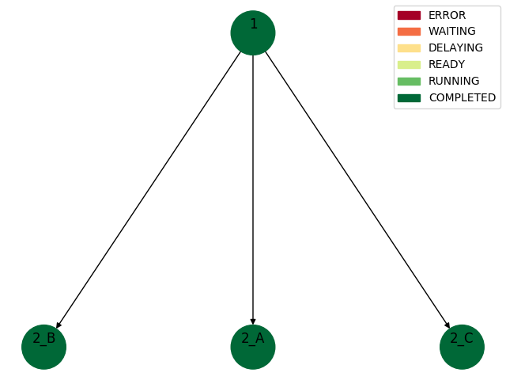
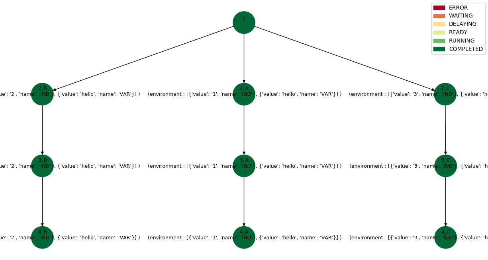

# Introduction

Welcome to the SWEEP Docs! You can use our SDK to access SWEEP endpoints or code against our REST endpoints.

We have language bindings in Python, and are working on JavaScript! You can view code examples in the dark area to the right, and you can switch the programming language (only Python where applicable) of the examples with the tabs in the top right.


# The workflow concept

A workflow is a collection of tasks, represented as a directed acyclic graph (DAG), where an edge from task A to task B indicates
that task B can start after task A is finished. The structure and syntax of workflow definitions are defined below.


## Creating **workflows**

> workflow definition

```python
{
    'workflow_id' : str,
    'config' : dict,
    'tasks' : list
}
```


* **workflow_id**: unique identifier of the workflow

* **tasks**: list of **task definition** dicts, each representing a task

* **config**: optional **workflow configuration** dict, contains directives for workflow orchestration


## Creating **workflow configurations**

> workflow configuration

```python
{
    'max_task_concurrency' : int,
    'max_task_runtime' : int
}
```

* **max_task_concurrency**: max number of tasks to run concurrently

* **max_task_runtime**: task timeout in seconds


## Definition of tasks

Tasks are defined by one or more **executables**, as well as additional orchestration information.

Functions and containers are the two types of executables supported by SWEEP.


> task definition

```python
{
    'id' : str,
    'execution_configurations' : [
        {
        'function_def_id' | 'container_def_id' : str,
        'priority' : int
        }
    ]
    'successors' : str list,
    'properties' : dict
}
```

* **id**: unique identifier

* **execution_configurations**: list of dicts that defines what **executables** this task can consist of, and their priority.

    for *function-based tasks*: **function_def_id** is given, it must correspond to the id of a **function definition** that has been registered in SWEEP. See [Creating function definitions](#creating-function-definitions).

    for *container-based tasks*: **container_def_id** is given, it must correspond to the id of a **container definition** that has been registered in SWEEP. See [Creating container definitions](#creating-container-definitions).

* **successors**: a list of tasks that should be invoked when the task finishes. this defines the DAG representing the workflow.

* **properties**: optional task properties dict


## Defintion of **task properties**

> task properties

```python
{
    'position' : str,
    'delay' : int,
    'static_input' : object,
    'multiplicity' : int
    'deploy_conditions' : expr list,
    'scatter' : expr,
    'follow' : str,
    'environment' : dict list | expr,
    'command' : str list,
    'static_output' : expr
}
```


> ### Task properties
> Task properties are static values that are associated with a task. This means that they do not change over time,
> they are associated with a workflow (unlike task attributes described below, which are associated with a particular launch of the workflow).


* **position**: the position in the task graph. used to define the starting task.
> There must be exactly one task with the property **'position' : 'start'**. This will be the first task that is executed, and all other tasks should be on a path from the start task in the DAG representation.

* **delay**: time in seconds that a task should wait before being launched. the delay begins when the task is otherwise ready to lauch, after all its predecessors have finished.

* **static_input**: input to the task that is independent of the launch, other tasks, etc.

* **multiplicity**: specifies a number of times a task should be replicated.

* **deploy_conditions**: list of conditions in the form of expressions depending on the output of this task predecessors that must be fulfilled in order for the task to be launched. if all predecessors have finished but any of the conditions is not true, the task fails.

* **scatter**: an expression that indicates which part of a predecessors output should be scattered over: this output is assumed to be of list-type, this task will be replicated for each element of this list, each new task replica receiving one element as input.

* **follow**: specifies a predecessor ID (P) whose replication factor this task (T) is to follow. A replica Ti of this task will gather all aggregatedd output of the corresponding replica Pi of the predecessor. See example below how scatter and follow can be used to define multi-level scatter and gather behaviour.

* **environment**: only valid for container-based tasks. specifies environment variables the image, overriding the one specified when building the image and the one in the container definition. one dictionary per environment variable, the dictionary must contains 2 items: 'name' and
'value'

* **command**: only valid for container-based tasks. specifies a command to run in the image, overriding the one specified when building the image and the one in the container definition.

* **static_output**: specfies a pre-determined item in the task's output. it will appear in the output-dictionary of a task with the key 'static_output', along with any other output that the actual task generates. **NOTE:** *unlike static_input, the *value* must not be determined before launch: static_output may be a str, in which case it is considered a dynamic property (see [Dynamic task properties](#dynamic-task-properties)), meaning it can e.g. specify a value in terms of the predecessor outputs.*


>Example of **environment** property:

```python
'environment' : [
                {'name': 'EVAR1', 'value': '1'},
                {'name': 'EVAR2', 'value': 'hello'}
              ]
```


#### Dynamic task properties
Dynamic task properties are properties whose value is decided at runtime.

They are specified by strings of Python expressions, e.g. by referencing the output of a previous tasks using the output variable "predecessor_outputs" as shown in the examples below (see [Communication between tasks](#communication-between-tasks)).

#### The properties that must be dynamic are:
* **deploy_conditions**
* **scatter**

#### The properties that may be dynamic are:
* **environment**
* **static_output**

If the value of these properties is of type str then they are treated as dynamic.


>Example of **deploy_conditions** property with one dynamic condition:

```python
"deploy_conditions" : ["predecessor_outputs['1']['buckets'][0]['count'] >= 4"]
```


>Example of a dynamic **static_output** property:

```python
"static_output" : "predecessor_outputs['1']['env_vars']"
```


## Creating **destinations**

A destination definition contains all the necessary information to execute a task on a cloud provider.

> destination definition
```python
  {
      'id' : str,
      'cloud_provider' : 'AWS' | 'Azure',
       ... the additional elements are cloud provider-dependent, see sections below ...
  }
```


required:

* **id:** unique identifier of the destination

* **cloud_provider:** the cloud provider of this destination


### AWS destinations

```python
  {
      'id' : str,
      'cloud_provider' : 'AWS',
      'credentials' : {profile_name : str , aws_account_id : str}
      'aws_region' : str
      'aws_ecs_iam_role' : str
      'aws_fargate_cluster' : str
      'aws_cluster_vpc_subnet_1' : str
      'aws_cluster_vpc_subnet_2' : str
      'aws_lambda_iam_role' : str

  }
```

* **profile_name:** name of the AWS credentials profile to use.

* **aws_account_id:** id of AWS account to use

* **aws_region:** AWS region to use

* **aws_ecs_iam_role:** IAM role for ECS execution (containers)

* **aws_fargate_cluster:** name of a Fargate cluster to use

* **aws_cluster_vpc_subnet_1:** VPC subnet of the Fargate cluster

* **aws_cluster_vpc_subnet_2:** VPC subnet of the Fargate cluster

* **aws_lambda_iam_role:** IAM role for Lambda execution (functions)

### Azure destinations

```python
  {
      'id' : str,
      'cloud_provider' : 'Azure',
      'credentials' : {'azure_auth_file':str}
      'azure_region' : str
      'azure_resource_group' : str
      'azure_container_registry' : str
  }
```

* **azure_auth_file:** filename of a file containing Azure authentication info.

* **azure_region:** Azure region to use

* **azure_resource_group:** name of the resource group to use

* **azure_container_registry:** name of the container registry to use


## Creating **function definitions**

Functions are currently only supported for the AWS cloud provider.

> A function definition contains three elements:
> 1. Where: A destination (cloud provider) where to run the function
> 2. What: A function to run
> 3. How: Information for defining the function (memory, runtime, etc.)

Function-based tasks are placed in a workflow by specifying a **function_def_id** in the **execution_configurations** of the workflow definition. This must correspond to the id of a *function_definition* that has been registered in SWEEP:

> function definition

```python
  {
      'id' : str,
      'destination_id' : str,
      'function_name' : str,

      'environment_variables' : dict
      'description' : str
      'memory' : int
      'runtime' : 'nodejs'|'nodejs4.3'|'nodejs6.10'|'nodejs8.10'|'nodejs10.x'|'nodejs12.x'|'java8'|'java8.al2'|'java11'|'python2.7'|'python3.6'|'python3.7'|'python3.8'|'dotnetcore1.0'|'dotnetcore2.0'|'dotnetcore2.1'|'dotnetcore3.1'|'nodejs4.3-edge'|'go1.x'|'ruby2.5'|'ruby2.7'|'provided'|'provided.al2',
  }
```


required:

* **id**: unique identifier of the function definition.

* **destination_id**: id of a destination, must be one that has already been registered in SWEEP. See [Creating destinations](#creating-destinations).

* **function_name**: the name of the function


optional:

* **environment_variables:** environment variables, e.g. {'EVAR1' : 'test'}

* **description:** string describing the function

* **memory:** the amount of memory that your function has access to, in MB. increasing the function's memory also increases its CPU allocation. the default value is 128 MB. the value must be a multiple of 64 MB

* **runtime:** the function runtime. default is python3.6
'nodejs'|'nodejs4.3'|'nodejs6.10'|'nodejs8.10'|'nodejs10.x'|'nodejs12.x'|'java8'|'java8.al2'|'java11'|'python2.7'|'python3.6'|'python3.7'|'python3.8'|'dotnetcore1.0'|'dotnetcore2.0'|'dotnetcore2.1'|'dotnetcore3.1'|'nodejs4.3-edge'|'go1.x'|'ruby2.5'|'ruby2.7'|'provided'|'provided.al2',


> Note that the *function_definition* does not contain information about the actual code of the function. This is only specified when uploading the function to SWEEP, after that the function is referred to using its *function_name*.

## Creating **container definitions**


> A container definition contains three elements:
> 1. Where: A destination (cloud provider) where to run the container
> 2. What: A docker image that the container will be based on
> 3. How: Information for defining the container (memory, cpu, command to run)

Container tasks are placed in a workflow by specifying a **container_def_id** in the **execution_configurations** of the workflow definition. This must correspond to the id of a *container_definition* that has been registered in SWEEP:

> container definition

```python
  {
      'id' : str,
      'destination_id' : str,
      'image_name' : str,
      'image_tag' : str,
      'cpu' : float,
      'memory' : int,
      'command' : str list
  }
```


required:

* **id**: unique identifier of the container definition.

* **destination_id**: id of a destination, must be one that has already been registered in SWEEP. See [Creating destinations](#creating-destinations).

* **image_name** and **image_tag**: define the image to base the container on.


optional:

*  **cpu_units**: number of CPU units allocated

*  **memory**: max memory allocated in MB

*  **command**: defines the command to run when starting the container, overriding the command specified in the docker image definition.


> **Runtime resources of the container**

> CPU units and memory are allocated and charged for even if not fully utilized.

> Values must be valid for the specified CP. See https://docs.aws.amazon.com/AmazonECS/latest/userguide/fargate-task-defs.html (Task CPU and Memory) for valid configurations for these values for Fargate.

> If not specified, default values (depending on CP) specified in the config file are used.


**NOTE:** the specified image and tag must exist in the local docker registry.

>   **trying to push another container definition with the same image_name and image_tag will**
>
>    * update the cpu, memory and command settings
>    * NOT overwrite the uploaded image (even if it has changed in the local docker repo) unless the optional argument --overwrite is given to sweep upload_container_def


The upload may take some time.

# Communication between tasks

## Inputs

Workflow tasks get input of the following structure:

> task input

```python
{
    'predecessor_outputs' : dict,
    'static_input' : dict
}
```

* **predecessor_outputs** contains outputs from every predecessor of the task. For every predecessor id x, the dictionary has an entry
      x : {output of task x}.

* **static_input** is the dict specified as this task's **static_input**-property in the workflow definition. Empty dict if no such property was specified.

The task input can be referenced in the workflow definition in dynamic task properties, e.g. an expression that specifies how a task should scatter based on the output of a predecessor.

The task input can not always be accessed in the executable code of the task, however. This depends on whether it is a function-based or container-based task, as described below.


### Input to function-based tasks

Function-based tasks receive the task input as a function argument, and it can therefore be accessed in the function code itself.

See [examples/lambda_function_template.py](examples/lambda_function_template.py) for an example of a function that accesses the output from its predecessors.


### Input to container-based tasks

Containers do not receive arguments, and the task input is therefore not directly available for the code that is executing in the container.

There are two ways through which information can be passed into containers:
1. the command to run when the container is launched
2. the environment variables of the container


Both of these can be set
* when creating the docker image
* in the SWEEP container definition **This overrides the ones specified when building the docker image**
* in the SWEEP workflow definition **This overrides both of the above**


### Example task input of a task with two predecessors:

```python
{
  'predecessor_outputs': {
    '1': {
      'msg': 'I completed successfully'
    },
    '2': {
      'buckets': 10,
      'static_output': 5
    }
  },
  'static_input': {}
}
```


## Outputs

The output of a task is made available to its succesors in the variable **predecessor_outputs**. The contents of this dict depend on the workflow definition, as well as the task executable.

* If a task has the **static_output** property set, this value will be stored in **predecessor_outputs**.

* If the executable of the task has a return value, the contents of this are also be stored in **predecessor_outputs**.


Only function-based tasks have return values. The only requirement of the return value is that it is a dict.

See [examples/lambda_function_template.py](examples/lambda_function_template.py) for an example of a function with a valid return value.

Containers do not have return values.


Container-based tasks behave just like function-based tasks in a workflow, except:

1. They do not receive input (not from predecessors, not static input).
2. They do not output anything to their successors.
3. Their status is defined by their exit code. This is the exit code of the docker container,
   which is the exit code of the command run inside the container. Exit code 0 means success.


# Code examples


## Setting up the API

```python
    user = 'username'
    key = 'pwd'
    url ='url'


    sweep_client = SWEEPApiClient(USER,KEY, IP)
```


## Add a destination definition

See [Creating destinations](#creating-destinations) for information on what the destination definition should contain.

```python

    response = sweep_client.register_destination(dfile='../path/to/def_dest1.json', user = user)
    print(response)

    > {'status': 'OK', 'msg': 'Successfully registered destinaiton dest1.'}

```


## Creating executables

### Add a function definition

#### Step 1: Write the function and compress it


```shell
    cd examples/hello_world_function
    zip -g hello_world.zip main.py
```


#### Step 2: Upload the function definition to SWEEP

```python

    response = sweep_client.upload_function_def(
	    function_def_file='examples/hello_world_function/fdef_hello_world.json',
	    function_code_file='examples/hello_world_function/hello_world.zip',
	    user = user)

    > {'status': 'OK', 'msg': 'Successfully uploaded function hello_world.'}

```


### Add a container definition

#### Step 1: Create a docker image and compress it

[examples/hello_world_container/hello_world](examples/hello_world_container/hello_world) contains files for creating a simple docker image that prints 'hello world'.

The script [examples/hello_world_container/docker_cmds_hello_world.sh](examples/hello_world_container/docker_cmds_hello_world.sh) contains commands
to build the image, run it locally and display its exit code, and compress it to a tar archive:

    $ ./docker_cmds_hello_world.sh

    > Sending build context to Docker daemon  3.072kB
        .
        .
        .
    > Successfully built 832c75e88988
    > Successfully tagged hello_world:latest
    > Hello world!
    > 0


#### Step 2: Upload the container definition to SWEEP

A container definition for the hello world image is in [examples/hello_world_container/container_def_hello_world.json](examples/hello_world_container/container_def_hello_world).

Use the SWEEP-API to upload the container definition:

```python
    container_def_file = 'examples/hello_world_container/container_def_hello_world.json'
    response = sweep_client.upload_container_def(
    	container_def_file='examples/hello_world_container/cdef_hello_world.json',
    	container_code_file='examples/hello_world_container/hello_world.tar',
	    user = user)

    print(response)
    > {'status': 'OK', 'msg': 'Started uploading image.'}
```

**Make sure the images you push are such that they return the exit code 0 if they run successfully**
This is standard behaviour, but you can check the exit code of a container locally by running
your image and printing the environment variable ?, which contains the exit code of the latest run command.

    docker run my_image; echo $?


## Add a workflow definition


```python
    response = sweep_client.register_workflow(
        wffile='examples/hello_world_workflow/workflow_def_hello_world.json',
        user = user)

    print(response)
    > '{'workflow_id': 'wfdef_hello_world', 'status' : 'OK', 'msg' : 'Successfully created workflow wfdef_hello_world for user username.'}'
```

## Launch and monitor the workflow

```python
    response = sweep_client.launch_workflow(
        wid='wfdef_hello_world',
        user=user)
    lid = response['launch_id']


    response = sweep_client.launch_status(wid='wfdef_hello_world', lid=lid, user=user)
    print(response)
```


# Example workflows

##  Example 1: A simple workflow

### workflow definition
See [examples/example1/example1.json](examples/example1/example1.json)

```python

{
  "workflow_id": "example1",
  "config": {},
  "tasks": [
    {
      "id": "1",
      "execution_configurations" : [
        {
          "function_def_id" : "my_lambda_function1",
          "priority" : 1
        }
      ],
      "successors": [
        "2",
        "3",
        "4"
      ],
      "properties": {
        "position": "start"
      }
    },
    {
      "id": "2",
      "execution_configurations" : [
        {
          "function_def_id" : "my_lambda_function2",
          "priority" : 1
        }
      ],
      "successors": [],
      "properties": {
        "static_input": {
          "msg": "static input message"
        }
      }
    },
    {
      "id": "3",
      "execution_configurations" : [
        {
          "function_def_id" : "my_lambda_function3",
          "priority" : 1
        }
      ],
      "successors": [
        "4"
      ],
      "properties": {
        "delay": 10
      }
    },
    {
      "id": "4",
      "execution_configurations" : [
        {
          "function_def_id" : "my_lambda_function4",
          "priority" : 1
        }
      ],

      "successors": []
    }
  ]
}
```

### DAG representation

<div style="text-align:left"></div>


##  Example 2: A workflow with a scattered task

### workflow definition

See [examples/example2/example2.json](examples/example2/example2.json)


```python

{
  "workflow_id": "example2",
  "config": {},
  "tasks": [
    {
      "id": "1",
      "execution_configurations" : [
        {
          "function_def_id" : "firstFunc",
          "priority" : 1
        }
      ],
      "successors": [
        "2"
      ],
      "properties": {
        "position": "start"
      }
    },
    {
      "id": "2",
      "execution_configurations" : [
        {
          "function_def_id" : "mutFunc",
          "priority" : 1
        }
      ],
      "successors": [
        "3"
      ],
      "properties": {
        "scatter": "predecessor_outputs['1']['tile']"
      }
    },
    {
      "id": "3",
      "execution_configurations" : [
        {
          "function_def_id" : "otherFunc",
          "priority" : 1
        }
      ],
      "successors": []
    }
  ]
}

```


If the function **firstFunc** generates the following output:

```python
{ "buckets": [{"count": 3}],
  "tile" : [{"tile_id" : 1}, {"tile_id" : 2},{"tile_id" : 3}]}
```


Then task **2** will be expanded to tasks **2_A**, **2_B**, **2_C**, each receiving the following input (where X = 0,1,2):

```python
{ "buckets": [{"count": 3}],
  "tile" : {"tile_id" : X}}
```


### DAG representation

Task **2** is a scatter task:

<div style="text-align:left"></div>

Upon completion of task **1**, task **2** is expanded into 3 tasks: **2_A**, **2_B** and **2_C**

<div style="text-align:left"></div>


## Example 3: A workflow with scatter and follow

### workflow definition
See [examples/example3/example3.json](examples/example3/example3.json)

```python

{
  "workflow_id": "example3",
  "config": {},
  "tasks": [
    {
      "id": "1",
      "execution_configurations" : [
        {
          "function_def_id" : "firstFunc",
          "priority" : 1
        }
      ],
      "successors": [
        "2"
      ],
      "properties": {
        "position": "start"
      }
    },
    {
      "id": "2",
      "execution_configurations" : [
        {
          "function_def_id" : "multFunc",
          "priority" : 1
        }
      ],
      "successors": [
        "3"
      ],
      "properties": {
        "scatter": "predecessor_outputs['1']['tile']"
      }
    },
    {
      "id": "3",
      "execution_configurations" : [
        {
          "function_def_id" : "otherFunc",
          "priority" : 1
        }
      ],
      "successors": [],
      "properties": {
        "follow": "2"
      }
    }
  ]
}

```


If the function **firstFunc** generates the same output as the examle above, and task **2** is expanded in the same manner:

Then task **3** will be expanded to tasks **3_A**, **3_B**, **3_C**, each of which becomes a successor of one of the tasks expanded from task **2**:


### DAG representation

Task **2** is a scatter task:

<div style="text-align:left"></div>

Upon expansion of task **2**, task **3** is expanded into 3 tasks: **3_A, 3_B** and **3_C**.

<div style="text-align:left"></div>


##  Example 4: A more complicated workflow with follow

### workflow definition
see  [examples/example4/example4.json](examples/example4/example4.json)

```python
{
  "workflow_id": "example4",
  "config": {},
  "tasks": [
    {
      "id": "1",
      "execution_configurations" : [
        {
          "function_def_id" : "firstFunc",
          "priority" : 1
        }
      ],
      "successors": [
        "2",
        "3"
      ],
      "properties": {
        "position": "start"
      }
    },
    {
      "id": "2",
      "execution_configurations" : [
        {
          "function_def_id" : "multFunc",
          "priority" : 1
        }
      ],
      "successors": [
        "4"
      ],
      "properties": {
        "scatter": "predecessor_outputs['1']['tile']"
      }
    },
    {
      "id": "3",
      "execution_configurations" : [
        {
          "function_def_id" : "lambda_func2",
          "priority" : 1
        }
      ],
      "successors": [
        "4"
      ]
    },
    {
      "id": "4",
      "execution_configurations" : [
        {
          "function_def_id" : "multFunc",
          "priority" : 1
        }
      ],
      "successors": [
        "5"
      ],
      "properties": {
        "follow": "2"
      }
    },
    {
      "id": "5",
      "execution_configurations" : [
        {
          "function_def_id" : "lambda_func2",
          "priority" : 1
        }
      ],
      "successors": []
    }
  ]
}

```


If the function **firstFunc** generates the same output as the examle above, and task **2** is expanded in the same manner:

Then task **4** will be expanded to tasks **4_A**, **4_B**, **4_C**, each of which becomes a successor of one of the tasks expanded from task **2**:


### DAG representation

<div style="text-align:left"></div>

When task **1** completes, task **2** can be expanded. In addition, task **4** can also immediately be expanded (without waiting for all task **2** instances to complete) since its multiplicity depends on the multiplicity of task **2**, which has already been decided.

<div style="text-align:left"></div>


##  Example 5: More ways to use scatter and gather

The properties **scatter** and **follow** can be used to define custom multi-layer scatter and gather structure in workflows. Examples 5a-5c illustrate three different examples of dynamically unrolling workflows, and how the DAG looks at different stages of execution.

See  [examples/example5](examples/example5) for the workflow definitions.

<div style="text-align:left"></div>


##  Example 6: A workflow with container overrides

A workflow with a single container-based task with command and environment variables defined in the workflow definition, overriding those in the docker image.

### workflow definition
see  [examples/example6/wf_def_overrides.json](examples/example6/wf_def_overrides.json)

```python
{
  "workflow_id": "wf_overrides",
  "config": {},
  "tasks": [
    {
      "id": 1,
      "execution_configurations" : [
        {
          "container_def_id" : "cdef_hello_world",
          "priority" : 1
        }
      ],
      "successors": [],
      "properties": {
        "position": "start",
        "command": [
          "sh",
          "-c",
          "printenv USERNAME"
        ],
        "environment": [
          {
            "name": "USERNAME",
            "value": "ka"
          },
          {
            "name": "IND",
            "value": "1"
          }
        ]
      }
    }
  ]
}


```

The optional task properties **environment** and **command** are used to specify additional information for the container the task is run in.

when this workflow is launched, task 1 will be run in a container and SWEEP will:

* set the two environment variables USERNAME and IND (overwriting any other definition of these)

* override the run command to 'printenv USERNAME'


##  Example 7: A workflow with dynamic container overrides

The task properties **environment** and **command** can also be specified as strings, in which case they must be valid expression that can be evaluated using eval()

This can be used to e.g. let the outputs of the previous task determine the values:

An example where a function-based task outputs information about how many container tasks should be launched, and what their environment variables should be:


### workflow definition

see [examples/example7/wf_def_overrides_pred.json](examples/example7/wf_def_overrides_pred.json)

```python

{
  "workflow_id": "wf_overrides_dynamic",
  "providers": [],
  "tasks": [
    {
      "id": "1",
      "execution_configurations": [
        {
          "function_def_id": "prepFunc",
          "priority": 1
        }
      ],
      "successors": [
        2
      ],
      "properties": {
        "position": "start"
      }
    },
    {
      "id": 2,
      "execution_configurations": [
        {
          "container_def_id": "cdef_hello_world",
          "priority": 1
        }
      ],
      "successors": [],
      "properties": {
        "scatter": "predecessor_outputs['1']['env_vars']",
        "command": [
          "sh",
          "-c",
          "printenv IND"
        ],
        "environment": "predecessor_outputs['1']['env_vars']"
      }
    }
  ]
}


```


> In this case, the output of the function prepFunc is scattered over.
> "predecessor_outputs['1']['env_vars']" will contain a list with one item for each subsequent task.

The definition of the lambda function **prepFunc** is [examples/example7/main.py](examples/example7/main.py)

```python

import json

def handler(event, context):
        print("Received event: " + json.dumps(event, indent=2))

        	response = {"num_inds": 3,
				"env_vars" : [
					[{"name": "IND", "value": "1"}, {"name": "VAR", "value": "hello"}],
					[{"name": "IND", "value": "2"}, {"name": "VAR", "value": "hello"}],
					[{"name": "IND", "value": "3"}, {"name": "VAR", "value": "hello"}]
				]
				}
        return response


```


### DAG representation

<div style="text-align:left"></div>


##  Example 8: A dynamic workflow with static output

Container-based tasks do not output any values to the workflow scheduler, but one way to propagate information through the workflow via container-based tasks is to use **static_output** property:

An example based on the previous one, but with a 3rd task that gets information from task 2:

### workflow definition

see [examples/example8/wf_def_static_output.json](examples/example8/wf_def_static_output.json)

```python

{
  "workflow_id": "wf_static_output",
  "config": {},
  "tasks": [
    {
      "id": "1",
      "execution_configurations": [
        {
          "function_def_id": "prepFunc",
          "priority": 1
        }
      ],
      "successors": [
        2
      ],
      "properties": {
        "position": "start"
      }
    },
    {
      "id": 2,
      "execution_configurations": [
        {
          "container_def_id": "cdef_hello_world",
          "priority": 1
        }
      ],
      "successors": [
        3
      ],
      "properties": {
        "scatter": "predecessor_outputs['1']['env_vars']",
        "command": [
          "sh",
          "-c",
          "printenv IND"
        ],
        "environment": "predecessor_outputs['1']['env_vars']",
        "static_output": "predecessor_outputs['1']['env_vars']"
      }
    },
    {
      "id": 3,
      "execution_configurations": [
        {
          "container_def_id": "cdef_hello_world",
          "priority": 1
        }
      ],
      "successors": [
        4
      ],
      "properties": {
        "follow": 2,
        "command": [
          "sh",
          "-c",
          "printenv IND"
        ],
        "environment": "predecessor_outputs['2']['static_output']",
        "static_output": "predecessor_outputs['2']['static_output']"
      }
    },
    {
      "id": 4,
      "execution_configurations": [
        {
          "container_def_id": "cdef_hello_world",
          "priority": 1
        }
      ],
      "successors": [],
      "properties": {
        "follow": 2,
        "command": [
          "sh",
          "-c",
          "printenv IND"
        ],
        "environment": "predecessor_outputs['3']['static_output']"
      }
    }
  ]
}


```


### DAG representation

The DAG of the completed workflow with the evaluated "environment" values annotated:

<div style="text-align:left"></div>

Tasks 2_A, 2_B, 2_C were run in separate containers with different values for environment variable IND.


r
